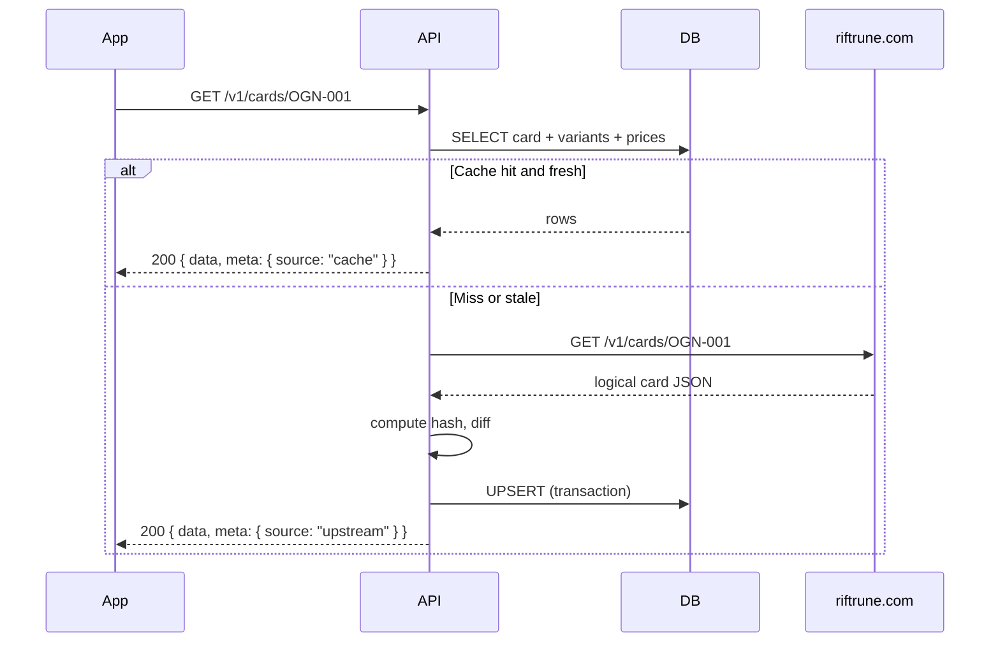

# Riftbound App — Implementation Specification

> **Architecture:** Expo (mobile + web) → **Our Elysia API** → PostgreSQL cache → riftrune.com External API  
> **Goal:** Type-safe, fast card catalog + Cardmarket prices with local persistence and hash-based upstream sync.

---

## 1. Executive summary

Build a monorepo containing:

1. **`apps/mobile`** — Expo app (iOS, Android, Web) using Expo Router
2. **`apps/api`** — ElysiaJS backend (TypeScript strict, Zod validation)
3. **`packages/contracts`** — Shared Zod schemas + inferred types (single source of truth)

The client **never** calls riftrune.com directly. Our API mirrors all **card-related** upstream data locally (cards, variants, sets, colors metadata, prices) using a **cache-aside + content-hash** invalidation strategy.

Decks and collection are **out of scope for v1 upstream sync** — stored only in our DB when we build those features.

---

## 2. Technology choices

| Layer                         | Choice                                        | Rationale                                                                                                                          |
| ----------------------------- | --------------------------------------------- | ---------------------------------------------------------------------------------------------------------------------------------- |
| Mobile + Web                  | **Expo SDK 54**                               | Latest SDK reliably available in **App Store / Play Store Expo Go** (June 2026). SDK 55/56 require TestFlight or Android sideload. |
| Routing                       | **Expo Router v4** (SDK 54)                   | File-based, works on web + native                                                                                                  |
| Server                        | **ElysiaJS** + `@elysiajs/swagger`            | Native TypeScript, Zod plugin, fast Bun runtime                                                                                    |
| Runtime                       | **Bun** (API)                                 | Fast startup, native TS, good Elysia fit                                                                                           |
| DB                            | **PostgreSQL 16** + **Drizzle ORM**           | Relational card/variant model, migrations, strict types                                                                            |
| Validation                    | **Zod 3**                                     | Shared client/server contracts                                                                                                     |
| HTTP client (server)          | `fetch` + typed wrapper                       | No extra deps                                                                                                                      |
| Client data                   | **TanStack Query v5**                         | Cache, stale-while-revalidate on client                                                                                            |
| Monorepo                      | **pnpm workspaces** + **Turborepo**           | Shared `contracts` package                                                                                                         |
| **UI / design reference**     | **`./manganess`** (sibling app in repo)       | Canonical patterns for theme, layout, motion, components                                                                           |
| Client state (theme/settings) | **Zedux** (`@zedux/react`)                    | Same as manganess — theme atom + settings persistence                                                                              |
| Motion                        | **react-native-reanimated** + gesture-handler | Press springs, `FadeInDown`, swipe-back                                                                                            |
| Images                        | **expo-image**                                | Cached card art, blur placeholders                                                                                                 |
| Icons                         | **@expo/vector-icons** (Ionicons)             | Matches manganess tab + UI icons                                                                                                   |

### Expo Go note (June 2026)

| SDK    | Expo Go availability                                |
| ------ | --------------------------------------------------- |
| **54** | App Store + Play Store ✅ (recommended for Expo Go) |
| 55     | iOS pending / variable                              |
| 56     | Android CLI / iOS simulator / TestFlight only       |

Use `npx create-expo-app@latest --template default@sdk-54` unless you adopt dev builds.

---

## 3. Repository structure

```
riftbound/
├── apps/
│   ├── api/                    # ElysiaJS backend
│   │   ├── src/
│   │   │   ├── index.ts
│   │   │   ├── env.ts          # Zod-validated env
│   │   │   ├── db/
│   │   │   │   ├── schema.ts   # Drizzle tables
│   │   │   │   └── client.ts
│   │   │   ├── upstream/
│   │   │   │   ├── riftrune-client.ts
│   │   │   │   └── types.ts    # Re-exports from contracts
│   │   │   ├── services/
│   │   │   │   ├── card-cache.ts
│   │   │   │   ├── price-cache.ts
│   │   │   │   ├── sync-engine.ts
│   │   │   │   └── hash.ts
│   │   │   ├── routes/
│   │   │   │   ├── cards.ts
│   │   │   │   ├── prices.ts
│   │   │   │   ├── filters.ts
│   │   │   │   └── sync.ts
│   │   │   └── plugins/
│   │   │       └── error-handler.ts
│   │   ├── drizzle/
│   │   └── package.json
│   └── mobile/                 # Expo app (UI modeled on ./manganess)
│       ├── app/                # Expo Router
│       │   ├── (tabs)/
│       │   │   ├── index.tsx       # Home
│       │   │   ├── search.tsx      # Card search (→ mangasearch.tsx patterns)
│       │   │   ├── collection.tsx
│       │   │   ├── decks.tsx
│       │   │   ├── settings.tsx    # → manganess settings patterns
│       │   │   └── _layout.tsx     # → manganess floating tab bar
│       │   ├── card/[variantNumber].tsx
│       │   └── _layout.tsx         # → manganess root layout
│       ├── constants/
│       │   ├── Colors.ts           # Port from manganess (+ Riftbound default accent)
│       │   └── Layout.ts           # Port from manganess (Spacing, Typography)
│       ├── hooks/
│       │   ├── useTheme.ts
│       │   ├── useThemeColor.ts
│       │   └── useDebounce.ts
│       ├── atoms/
│       │   ├── themeAtom.ts
│       │   └── settingsAtom.ts
│       ├── components/             # Riftbound components, manganess-shaped APIs
│       │   ├── cards/
│       │   ├── navigation/
│       │   ├── feedback/           # Skeleton, ErrorBoundary, OfflineIndicator
│       │   └── ui/                 # Button, Badge, SearchInput, BottomPopup
│       ├── utils/
│       │   └── haptics.ts
│       └── src/api/                # Typed fetch to our API
├── packages/
│   └── contracts/              # Shared Zod schemas
│       ├── src/
│       │   ├── cards.ts
│       │   ├── prices.ts
│       │   ├── filters.ts
│       │   ├── api.ts          # Request/response wrappers
│       │   └── index.ts
│       └── package.json
├── docker-compose.yml          # Postgres
├── turbo.json
├── pnpm-workspace.yaml
└── SPEC.md
```

---

## 4. Upstream: riftrune.com External API

**Base URL:** `https://riftrune.com/api/external`  
**Auth:** `x-api-key: <RIFTRUNE_API_KEY>` (server env only — never in Expo app)

### 4.1 Endpoints we consume (v1)

| Method | Upstream path               | Purpose                                    | Cache strategy                        |
| ------ | --------------------------- | ------------------------------------------ | ------------------------------------- |
| `GET`  | `/v1/cards`                 | Paginated variant list + `meta.filters`    | Full catalog sync + query backfill    |
| `GET`  | `/v1/cards/{variantNumber}` | Logical card + all variants                | Per-card cache (key: `variantNumber`) |
| `POST` | `/v1/cards/batch`           | Batch by `variantNumbers[]`                | Backfill missing variants             |
| `GET`  | `/v1/prices`                | All Cardmarket prices (~2288 rows, ~757KB) | Daily bulk sync                       |

### 4.2 Upstream query parameters (`GET /v1/cards`)

Mirror these in our API for passthrough when local index is incomplete:

```
q, name, description, artist, flavor, id,
colors, sets, types, supertypes, variants, excludeVariants,
rarities, tags, artworks, releaseDateAfter,
sortBy | sort, dir,
energyMin, energyMax, powerMin, powerMax, mightMin, mightMax,
qtyMin, qtyMax, page, limit (max 100), new
```

### 4.3 Upstream response shapes (canonical)

**Logical card** (`GET /v1/cards/OGN-001`):

```ts
PaLogicalCard = {
  id: string                    // UUID — logical card id
  name: string
  type: string
  super: string | null
  description: string
  energy: number
  might: number
  power: number
  tags: string[]
  attachText: string | null
  effect: string | null
  mightBonus: number
  maxCopies: number | null
  banEffectiveDate: string | null
  colors: PaColor[]
  variants: PaVariant[]
}
```

**Variant list item** (`GET /v1/cards?limit=1` → `data[]`):

```ts
PaVariantListItem = {
  id: string                    // variant UUID
  variantNumber: string         // e.g. "OGN-001" — PRIMARY LOOKUP KEY
  rarity: string
  variantType: string
  foilMode: string
  variantTypes: string[]
  imageUrl: string
  flavorText: string | null
  artist: string
  releaseDate: string
  variantLabel: string
  showInLibrary: boolean
  isCollectible: boolean
  cardmarketId: number | null
  tcgplayerId: number | null
  parentVariantId: string | null
  set: PaSet
  card?: PaLogicalCard          // sometimes embedded in list responses
}
```

**List envelope:**

```ts
PaCardsListResponse = {
  data: PaVariantListItem[]
  pagination: {
    total: number
    page: number
    limit: number
    totalPages: number
    hasNext: boolean
    hasPrevious: boolean
  }
  meta?: {
    filters: PaFilterSnapshot   // sets, colors, types, rarities, variants counts
  }
}
```

**Batch:**

```ts
PaCardsBatchResponse = {
  data: PaVariantListItem[]
  notFound: string[]
}
```

**Price row:**

```ts
PaPriceRow = {
  id: string
  cardmarketId: number
  tcgPlayerId: number | null
  provider: "cardmarket"
  isFoil: boolean
  currency: "EUR"
  lowPrice: string | null
  marketPrice: string | null
  midPrice: string | null
  highPrice: string | null
  directLowPrice: string | null
  avg1Day: string | null
  avg7Day: string | null
  avg30Day: string | null
  lastUpdated: string           // ISO datetime
}
```

### 4.4 Upstream limitations (design around these)

1. **No ETag / Last-Modified** — we must compute our own content hashes
2. **`GET /v1/prices` ignores filters** — always returns full catalog; filter locally
3. **Prices updated ~daily** (`lastUpdated` observed: T-1 day)
4. **Rate limits undocumented** — our cache layer is mandatory, not optional

---

## 5. Our API design

**Base URL:** `https://api.<your-domain>` (dev: `http://localhost:3000`)

### 5.1 Design principles

1. **Client → us only** — Riftrune key stays server-side
2. **Stable response contracts** — Zod schemas in `packages/contracts`, versioned (`/v1`)
3. **Fast reads from Postgres** — upstream is fallback + sync source
4. **ETag on our responses** — `ETag: "<content_hash>"` for client conditional requests
5. **Envelope consistency** — all responses use `{ data, meta?, error? }`
6. **Source transparency** — `meta.source: "cache" | "upstream" | "cache-refreshed"`

### 5.2 Public routes (v1)

#### `GET /v1/health`

```ts
Response: { data: { status: "ok", db: "ok", lastCatalogSync: string | null } }
```

#### `GET /v1/filters`

Returns latest cached `meta.filters` snapshot from catalog sync.

```ts
Response: {
  data: FilterSnapshot
  meta: { cachedAt: string, catalogHash: string }
}
```

#### `GET /v1/cards`

Search/list cards from **local DB**. Missing pages backfilled from upstream async or on-demand.

| Query                     | Type    | Notes                                            |
| ------------------------- | ------- | ------------------------------------------------ |
| `q`                       | string  | Full-text on name + variantNumber                |
| `sets`                    | string  | Comma-separated set codes                        |
| `colors`                  | string  | Comma-separated                                  |
| `types`                   | string  | Comma-separated                                  |
| `rarities`                | string  | Comma-separated                                  |
| `energyMin` / `energyMax` | number  |                                                  |
| `powerMin` / `powerMax`   | number  |                                                  |
| `mightMin` / `mightMax`   | number  |                                                  |
| `page`                    | number  | default 1                                        |
| `limit`                   | number  | default 50, max 100                              |
| `sortBy`                  | enum    | `name`, `energy`, `variantNumber`, `releaseDate` |
| `dir`                     | enum    | `asc`, `desc`                                    |
| `refresh`                 | boolean | Force upstream revalidation for matched rows     |

```ts
Response: {
  data: CardListItem[]
  meta: {
    pagination: Pagination
    source: "cache" | "mixed"
    catalogHash: string
  }
}
```

**`CardListItem`** (our optimized shape — flattened for list views):

```ts
CardListItem = {
  variantNumber: string         // "OGN-001"
  name: string
  type: string
  energy: number
  might: number
  power: number
  rarity: string
  setCode: string
  colors: string[]              // ["Fury"]
  imageUrl: string
  cardmarketId: number | null
  priceEur: PriceSummary | null // joined from local prices
}
```

#### `GET /v1/cards/:variantNumber`

Returns full logical card + variants + prices.

**Flow:**

```
1. SELECT logical_card + variants + prices FROM DB WHERE variant_number = :id
2. IF found AND NOT stale(card) → return 200 + ETag
3. ELSE → fetch PA GET /v1/cards/:variantNumber
4. Compute content_hash, upsert all rows
5. Return 200 + ETag
```

`:variantNumber` pattern: `^[A-Z]+-[A-Z0-9]+(-[A-Za-z]+)?$` (OGN-001, OGN-001-Foil, UNL-079a)

```ts
Response: {
  data: CardDetail
  meta: { source: "cache" | "upstream" | "cache-refreshed", contentHash: string }
}
```

#### `POST /v1/cards/batch`

```ts
Request: { variantNumbers: string[] }  // max 100
Response: {
  data: CardDetail[]
  meta: { found: number, notFound: string[], source: "cache" | "mixed" }
}
```

Batch logic: resolve all from DB → collect misses → single PA batch POST → upsert → merge.

#### `GET /v1/prices`

Serve from local `prices` table.

| Query           | Type                         |
| --------------- | ---------------------------- |
| `cardmarketId`  | number                       |
| `variantNumber` | string (resolve via variant) |
| `isFoil`        | boolean                      |

```ts
Response: {
  data: PriceRow[]
  meta: { pricesCatalogHash: string, lastSyncedAt: string }
}
```

#### `GET /v1/sync/status` (optional auth in prod)

```ts
Response: {
  data: {
    catalog: { lastRun: string, status: "idle"|"running"|"failed", hash: string, variantCount: number }
    prices: { lastRun: string, status: string, hash: string, rowCount: number }
  }
}
```

#### `POST /v1/sync/catalog` (admin/cron only)

Triggers full or incremental catalog sync.

#### `POST /v1/sync/prices` (admin/cron only)

Triggers price bulk pull from upstream.

---

## 6. Database schema (PostgreSQL + Drizzle)

### 6.1 Core tables

```sql
-- Logical card (game entity)
cards (
  id                UUID PRIMARY KEY,          -- PA logical card id
  name              TEXT NOT NULL,
  type              TEXT NOT NULL,
  super             TEXT,
  description       TEXT NOT NULL,
  energy            SMALLINT NOT NULL,
  might             SMALLINT NOT NULL,
  power             SMALLINT NOT NULL,
  tags              JSONB NOT NULL DEFAULT '[]',
  attach_text       TEXT,
  effect            TEXT,
  might_bonus       SMALLINT DEFAULT 0,
  max_copies        SMALLINT,
  ban_effective_date TIMESTAMPTZ,
  content_hash      CHAR(64) NOT NULL,         -- SHA-256 canonical JSON
  upstream_raw      JSONB NOT NULL,            -- full PA logical card blob
  fetched_at        TIMESTAMPTZ NOT NULL,
  updated_at        TIMESTAMPTZ NOT NULL DEFAULT now()
);

-- Printable variant (primary user-facing key)
variants (
  id                UUID PRIMARY KEY,          -- PA variant id
  card_id           UUID NOT NULL REFERENCES cards(id),
  variant_number    TEXT NOT NULL UNIQUE,      -- "OGN-001"
  rarity            TEXT NOT NULL,
  variant_type      TEXT NOT NULL,
  foil_mode         TEXT NOT NULL,
  variant_types     JSONB NOT NULL,
  image_url         TEXT NOT NULL,
  flavor_text       TEXT,
  artist            TEXT,
  release_date      DATE,
  variant_label     TEXT,
  show_in_library   BOOLEAN NOT NULL,
  is_collectible    BOOLEAN NOT NULL,
  cardmarket_id     INTEGER,
  tcgplayer_id      INTEGER,
  parent_variant_id UUID REFERENCES variants(id),
  set_id            UUID NOT NULL,
  content_hash      CHAR(64) NOT NULL,
  upstream_raw      JSONB NOT NULL,
  fetched_at        TIMESTAMPTZ NOT NULL,
  updated_at        TIMESTAMPTZ NOT NULL DEFAULT now()
);

-- Index for search
CREATE INDEX variants_variant_number_idx ON variants(variant_number);
CREATE INDEX variants_cardmarket_id_idx ON variants(cardmarket_id);
CREATE INDEX cards_name_trgm_idx ON cards USING gin(name gin_trgm_ops);

sets (
  id                UUID PRIMARY KEY,
  code              TEXT NOT NULL UNIQUE,      -- "OGN"
  name              TEXT NOT NULL,
  release_date      DATE
);

colors (
  id                UUID PRIMARY KEY,
  name              TEXT NOT NULL UNIQUE,
  hex_code          TEXT,
  image_url         TEXT
);

card_colors (
  card_id           UUID REFERENCES cards(id),
  color_id          UUID REFERENCES colors(id),
  PRIMARY KEY (card_id, color_id)
);

prices (
  id                UUID PRIMARY KEY,          -- PA price row id
  cardmarket_id     INTEGER NOT NULL,
  is_foil           BOOLEAN NOT NULL,
  provider          TEXT NOT NULL DEFAULT 'cardmarket',
  currency          TEXT NOT NULL DEFAULT 'EUR',
  low_price         NUMERIC(12,2),
  market_price      NUMERIC(12,2),
  mid_price         NUMERIC(12,2),
  high_price        NUMERIC(12,2),
  direct_low_price  NUMERIC(12,2),
  avg_1_day         NUMERIC(12,2),
  avg_7_day         NUMERIC(12,2),
  avg_30_day        NUMERIC(12,2),
  upstream_last_updated TIMESTAMPTZ NOT NULL,
  content_hash      CHAR(64) NOT NULL,
  fetched_at        TIMESTAMPTZ NOT NULL,
  UNIQUE (cardmarket_id, is_foil)
);
```

### 6.2 Sync metadata tables

```sql
sync_state (
  key               TEXT PRIMARY KEY,          -- "catalog" | "prices" | "filters"
  content_hash      CHAR(64) NOT NULL,
  row_count         INTEGER,
  last_success_at   TIMESTAMPTZ,
  last_attempt_at   TIMESTAMPTZ,
  last_error        TEXT,
  status            TEXT NOT NULL DEFAULT 'idle'
);

filter_snapshots (
  id                SERIAL PRIMARY KEY,
  snapshot          JSONB NOT NULL,            -- meta.filters from PA
  content_hash      CHAR(64) NOT NULL,
  captured_at       TIMESTAMPTZ NOT NULL DEFAULT now()
);
```

---

## 7. Hashing & invalidation strategy

PA provides no ETags. We implement **three hash layers**:

### 7.1 Entity content hash

```ts
function entityHash(obj: unknown): string {
  return sha256(canonicalJson(obj)); // recursive key-sorted JSON.stringify
}
```

Stored on `cards.content_hash`, `variants.content_hash`, `prices.content_hash`.

**On upstream fetch:**

```
IF upstream_hash === db.content_hash → skip write (no-op)
ELSE → UPSERT + update timestamps
```

### 7.2 Catalog fingerprint (cheap change detection)

Before full pagination sync, fetch `GET /v1/cards?limit=1` and hash:

```ts
catalogFingerprint = sha256({
  total: pagination.total,
  filters: meta.filters, // full filter counts snapshot
});
```

```
IF catalogFingerprint === sync_state["catalog"].content_hash
  → skip full sync (catalog unchanged)
ELSE
  → run paginated sync (all pages, limit=100)
  → update sync_state
```

### 7.3 Prices catalog hash

After `GET /v1/prices`, hash sorted tuple list:

```ts
pricesFingerprint = sha256(
  rows
    .map((r) => `${r.cardmarketId}:${r.isFoil}:${r.lastUpdated}:${r.marketPrice}`)
    .sort()
    .join('|')
);
```

Run daily (cron) or when `prices.lastSyncedAt` > 24h on read.

### 7.4 Per-request stale policy (TTL + hash)

| Entity            | Soft TTL | Hard TTL | Revalidate trigger                             |
| ----------------- | -------- | -------- | ---------------------------------------------- |
| Logical card      | 6h       | 7d       | `?refresh=true` or hash mismatch on spot-check |
| Variant list page | 1h       | 7d       | catalog fingerprint change                     |
| Prices            | 12h      | 48h      | daily cron or prices fingerprint               |
| Filters           | 1h       | 24h      | catalog fingerprint change                     |

**Stale-while-revalidate:** If within hard TTL but past soft TTL, return cached data immediately and enqueue background upstream check.

### 7.5 Background jobs

| Job           | Schedule        | Action                                           |
| ------------- | --------------- | ------------------------------------------------ |
| `syncCatalog` | Every 6h        | Fingerprint check → full pagination if changed   |
| `syncPrices`  | Daily 03:00 UTC | Pull full prices dump, diff by hash              |
| `vacuumStale` | Weekly          | Delete orphaned rows if variant removed upstream |

Use BullMQ + Redis in production; for MVP, `setInterval` in API process or external cron hitting `/v1/sync/*`.

---

## 8. Cache-aside flows

### 8.1 Single card (`GET /v1/cards/OGN-001`)



### 8.2 Search (`GET /v1/cards?q=diana`)

1. Query local `cards` + `variants` with SQL (indexed)
2. If `meta.pagination.total` from last catalog sync < PA fingerprint total → trigger background catalog sync
3. If local results < `limit` and user on last pages → optional upstream passthrough for completeness
4. Join `prices` on `cardmarket_id`

### 8.3 Prices join

```sql
SELECT v.*, p.market_price, p.low_price, p.avg_7_day
FROM variants v
LEFT JOIN prices p ON p.cardmarket_id = v.cardmarket_id AND p.is_foil = false
WHERE v.variant_number = $1
```

Return foil + non-foil as array on detail view.

---

## 9. Shared contracts (`packages/contracts`)

Single source of truth. Example:

```ts
// packages/contracts/src/cards.ts
import { z } from 'zod';

export const VariantNumber = z.string().regex(/^[A-Z]+-[A-Z0-9]+([-*][A-Za-z0-9]+)?$/);

export const PriceSummary = z.object({
  currency: z.literal('EUR'),
  low: z.number().nullable(),
  market: z.number().nullable(),
  avg7d: z.number().nullable(),
  isFoil: z.boolean(),
});

export const CardListItem = z.object({
  variantNumber: VariantNumber,
  name: z.string(),
  type: z.string(),
  energy: z.number().int(),
  might: z.number().int(),
  power: z.number().int(),
  rarity: z.string(),
  setCode: z.string(),
  colors: z.array(z.string()),
  imageUrl: z.string().url(),
  cardmarketId: z.number().int().nullable(),
  priceEur: PriceSummary.nullable(),
});

export const CardDetail = z.object({
  id: z.string().uuid(),
  name: z.string(),
  type: z.string(),
  description: z.string(),
  energy: z.number().int(),
  might: z.number().int(),
  power: z.number().int(),
  tags: z.array(z.string()),
  colors: z.array(
    z.object({
      id: z.string().uuid(),
      name: z.string(),
      hexCode: z.string().optional(),
    })
  ),
  variants: z.array(
    z.object({
      id: z.string().uuid(),
      variantNumber: VariantNumber,
      rarity: z.string(),
      imageUrl: z.string().url(),
      cardmarketId: z.number().int().nullable(),
      prices: z.array(PriceSummary),
    })
  ),
});

export const CardsListResponse = z.object({
  data: z.array(CardListItem),
  meta: z.object({
    pagination: z.object({
      total: z.number().int(),
      page: z.number().int(),
      limit: z.number().int(),
      totalPages: z.number().int(),
      hasNext: z.boolean(),
    }),
    source: z.enum(['cache', 'mixed', 'upstream']),
    catalogHash: z.string(),
  }),
});

export type CardListItem = z.infer<typeof CardListItem>;
export type CardDetail = z.infer<typeof CardDetail>;
```

Elysia usage:

```ts
import { Elysia } from 'elysia';
import { zodToJsonSchema } from 'zod-to-json-schema';
import { CardsListResponse, CardDetail } from '@riftbound/contracts';

new Elysia().get('/v1/cards/:variantNumber', handler, {
  response: CardDetail, // via elysia-zod plugin
});
```

Expo client:

```ts
import { CardDetail } from '@riftbound/contracts';

const res = await fetch(`${API_URL}/v1/cards/OGN-001`);
const json = CardDetail.parse((await res.json()).data);
```

---

## 10. Elysia API implementation outline

### 10.1 Environment (`env.ts`)

```ts
const EnvSchema = z.object({
  NODE_ENV: z.enum(['development', 'production', 'test']),
  PORT: z.coerce.number().default(3000),
  DATABASE_URL: z.string().url(),
  RIFTRUNE_API_KEY: z.string().startsWith('ak_'),
  RIFTRUNE_BASE_URL: z
    .string()
    .url()
    .default('https://riftrune.com/api/external'),
  SYNC_CRON_ENABLED: z.coerce.boolean().default(true),
  ADMIN_SYNC_TOKEN: z.string().min(32), // protects POST /v1/sync/*
});
```

### 10.2 Upstream client

```ts
class RiftruneClient {
  async getCard(variantNumber: string): Promise<PaLogicalCard>;
  async listCards(params: PaListParams): Promise<PaCardsListResponse>;
  async batchCards(variantNumbers: string[]): Promise<PaCardsBatchResponse>;
  async getAllPrices(): Promise<PaPriceRow[]>;
}
```

- 10s timeout, 3 retries with exponential backoff
- Circuit breaker after 5 consecutive failures (30s open)
- Request logging with correlation id

### 10.3 Service layer

| Service             | Responsibility                                 |
| ------------------- | ---------------------------------------------- |
| `CardCacheService`  | getByVariantNumber, search, upsertFromUpstream |
| `PriceCacheService` | getByCardmarketId, bulkUpsert                  |
| `SyncEngine`        | catalog + prices jobs, fingerprint checks      |
| `HashService`       | canonical JSON + SHA-256                       |

All DB writes in **transactions** per card (logical + variants + colors + set).

### 10.4 Performance optimizations

| Technique                    | Where                                                        |
| ---------------------------- | ------------------------------------------------------------ |
| Prepared statements          | Drizzle / pg pool                                            |
| Connection pool `max: 20`    | pg                                                           |
| Covering indexes             | `variants(variant_number)`, `prices(cardmarket_id, is_foil)` |
| `SELECT` only needed columns | list endpoint                                                |
| Response compression         | `@elysiajs/compress`                                         |
| Our ETag                     | `If-None-Match` → 304                                        |
| Batch upstream calls         | coalesce misses per request                                  |
| Pagination cursor            | optional upgrade from offset                                 |
| Read replica                 | future scaling                                               |

**Target latencies (cache hit):**

| Endpoint                        | p50    | p95     |
| ------------------------------- | ------ | ------- |
| `GET /v1/cards/:id`             | < 20ms | < 50ms  |
| `GET /v1/cards?q=`              | < 40ms | < 100ms |
| `POST /v1/cards/batch` (20 ids) | < 30ms | < 80ms  |

---

## 11. Expo app implementation outline

> **Design mandate:** The mobile/web app MUST follow UI patterns, theme architecture, and interaction design from **`./manganess`** in this repository. Treat manganess as the visual and structural reference — not a dependency to import at runtime, but the spec to port and adapt.

### 11.1 Stack

- Expo SDK **54**, Expo Router, React 19
- TanStack Query for server state
- `@riftbound/contracts` for response parsing
- **Zedux** for theme/settings (same atom pattern as manganess)
- **react-native-reanimated** + **gesture-handler** for press/swipe animations
- `expo-image` for card images (CDN cache)
- `@expo/vector-icons` (Ionicons)
- `expo-haptics` via shared `haptics.ts` utility
- Platform: iOS, Android, Web (single codebase)

### 11.2 API client

```ts
// apps/mobile/src/api/client.ts
const API_URL = process.env.EXPO_PUBLIC_API_URL!;

export async function apiGet<T>(path: string, schema: z.ZodType<T>): Promise<T> {
  const res = await fetch(`${API_URL}${path}`, {
    headers: { Accept: 'application/json' },
  });
  if (!res.ok) throw new ApiError(res.status, await res.text());
  const body = await res.json();
  return schema.parse(body.data);
}
```

### 11.3 Screens (v1)

| Screen      | manganess reference           | API calls                      |
| ----------- | ----------------------------- | ------------------------------ |
| Home        | `(tabs)/index.tsx`            | Featured / recent (local)      |
| Card search | `(tabs)/mangasearch.tsx`      | `GET /v1/cards?q=&sets=&page=` |
| Card detail | `(tabs)/manga/[id].tsx`       | `GET /v1/cards/:variantNumber` |
| Filters     | genres + search filter chips  | `GET /v1/filters`              |
| Collection  | `(tabs)/bookmarks.tsx` layout | Local DB (future)              |
| Decks       | list patterns from bookmarks  | Local DB (future)              |
| Settings    | `(tabs)/settings.tsx`         | Theme, accent, layout prefs    |

### 11.4 Web support

- `app.json`: `"web": { "bundler": "metro" }`, `"userInterfaceStyle": "automatic"`
- `EXPO_PUBLIC_API_URL` → `http://localhost:3000` in dev
- CORS on Elysia: `@elysiajs/cors` for web origin
- Splash/adaptive icon background: `#121212` (manganess dark baseline)

---

## 12. Security

| Rule             | Implementation                                            |
| ---------------- | --------------------------------------------------------- |
| Riftrune API key | `RIFTRUNE_API_KEY` env on server only                     |
| Sync endpoints   | `Authorization: Bearer <ADMIN_SYNC_TOKEN>`                |
| Client auth      | None in v1 (add Clerk/JWT when collection syncs per-user) |
| Input validation | Zod on every route                                        |
| SQL injection    | Drizzle parameterized queries only                        |

---

## 13. Implementation phases

### Phase 0 — Scaffold (1–2 days)

- [ ] pnpm monorepo + Turborepo
- [ ] `packages/contracts` with core Zod schemas
- [ ] `apps/api` Elysia hello world + Swagger
- [ ] `apps/mobile` Expo SDK 54 + Expo Router tabs
- [ ] **Port UI foundation from `./manganess`:** `Colors.ts`, `Layout.ts`, `useTheme`, `themeAtom`, `haptics.ts`, root `_layout.tsx` shell
- [ ] Docker Compose Postgres
- [ ] Drizzle schema + initial migration

### Phase 1 — Upstream client + hash utils (1–2 days)

- [ ] `RiftruneClient` with typed responses
- [ ] `HashService` canonical JSON
- [ ] Unit tests against recorded fixtures (VCR-style JSON files)

### Phase 2 — Card cache (3–4 days)

- [ ] DB upsert for logical card + variants + sets + colors
- [ ] `GET /v1/cards/:variantNumber` cache-aside
- [ ] `POST /v1/cards/batch`
- [ ] `GET /v1/cards` local search with indexes

### Phase 3 — Prices + sync jobs (2–3 days)

- [ ] Prices bulk sync + `prices` table
- [ ] Price join on card detail
- [ ] `syncCatalog` + `syncPrices` jobs
- [ ] `GET /v1/sync/status`, `POST /v1/sync/*`
- [ ] Catalog fingerprint short-circuit

### Phase 4 — Expo UI (3–5 days)

- [ ] Floating pill tab bar (from manganess `(tabs)/_layout.tsx`)
- [ ] `CardTile` component (from `MangaCard.tsx` — press spring, expo-image, skeleton)
- [ ] Search screen (from `mangasearch.tsx` — debounce, history, grid/list toggle, empty states)
- [ ] Card detail with prices (EUR, foil toggle) — detail layout from `manga/[id].tsx`
- [ ] `SearchSkeleton` / shimmer loading states
- [ ] Settings screen (theme picker, accent color — from manganess settings)
- [ ] TanStack Query + optimistic UI
- [ ] Web layout polish

### Phase 5 — Hardening (2–3 days)

- [ ] ETag / 304 support
- [ ] Error boundaries, loading states
- [ ] Integration tests (API)
- [ ] Deploy API (Railway/Fly) + Expo EAS for mobile

**Total estimate:** ~12–19 dev days for v1

---

## 14. Local development

```bash
# Terminal 1 — DB
docker compose up -d postgres

# Terminal 2 — API
cd apps/api
cp .env.example .env   # add RIFTRUNE_API_KEY
bun run db:migrate
bun run dev            # :3000

# Terminal 3 — seed cache
curl -X POST http://localhost:3000/v1/sync/catalog -H "Authorization: Bearer $ADMIN_SYNC_TOKEN"
curl -X POST http://localhost:3000/v1/sync/prices  -H "Authorization: Bearer $ADMIN_SYNC_TOKEN"

# Terminal 4 — Expo
cd apps/mobile
EXPO_PUBLIC_API_URL=http://localhost:3000 npx expo start
```

---

## 15. Open decisions (confirm before build)

1. **Expo SDK 54 vs 55** — 54 for store Expo Go; 55+ if you accept dev builds
2. **Auth provider** for future collection — Clerk (matches PA) vs own auth
3. **Deploy target** — Railway, Fly.io, or VPS for API + managed Postgres
4. **Redis** — add in Phase 5 if sync job queue needed before scale

---

## 16. Success criteria (v1)

- [ ] Client never contacts `riftrune.com` directly
- [ ] 100% of card catalog stored locally after initial sync (~998 variants)
- [ ] Card detail served from DB in < 50ms p95 after warm cache
- [ ] Hash diff prevents unnecessary DB writes on unchanged upstream data
- [ ] Cardmarket EUR prices displayed on detail view
- [ ] Shared Zod types compile in both API and Expo without drift
- [ ] App runs on iOS + Android (Expo Go SDK 54) + Web
- [ ] UI is visually consistent with `./manganess` (theme, tab bar, cards, search, settings)

---

## 17. UI & design system (reference: `./manganess`)

The Riftbound app should feel like it was built by the same team as manganess: dark-first, clean cards, soft motion, floating navigation. **Do not invent a new design language** — port and adapt the existing one.

### 17.1 Reference map

| manganess file                    | Riftbound equivalent                       | What to copy                                                                              |
| --------------------------------- | ------------------------------------------ | ----------------------------------------------------------------------------------------- |
| `constants/Colors.ts`             | `apps/mobile/constants/Colors.ts`          | Light/dark tokens, runtime accent override                                                |
| `constants/Layout.ts`             | `apps/mobile/constants/Layout.ts`          | `Spacing`, `Layout`, `Typography`, `CommonStyles`                                         |
| `hooks/useTheme.ts`               | `hooks/useTheme.ts`                        | `actualTheme`, `setTheme`, `setAccentColor`                                               |
| `hooks/useThemeColor.ts`          | `hooks/useThemeColor.ts`                   | Prop-aware color resolver                                                                 |
| `atoms/themeAtom.ts`              | `atoms/themeAtom.ts`                       | Zedux theme + accent sync with settings                                                   |
| `atoms/settingsAtom.ts`           | `atoms/settingsAtom.ts`                    | AsyncStorage persistence (`app_settings`)                                                 |
| `app/_layout.tsx`                 | `app/_layout.tsx`                          | `GestureHandlerRootView`, `EcosystemProvider`, `ErrorBoundary`, `NavigationThemeProvider` |
| `app/(tabs)/_layout.tsx`          | `app/(tabs)/_layout.tsx`                   | **Floating pill tab bar** (90% width, radius 35, active dot indicator)                    |
| `components/MangaCard.tsx`        | `components/cards/CardTile.tsx`            | Image card, press scale spring, loading/error states                                      |
| `components/SkeletonLoading.tsx`  | `components/feedback/CardSkeleton.tsx`     | Shimmer placeholders                                                                      |
| `components/SearchSkeleton.tsx`   | `components/feedback/SearchSkeleton.tsx`   | Search loading grid                                                                       |
| `app/(tabs)/mangasearch.tsx`      | `app/(tabs)/search.tsx`                    | Search input, debounce, grid/list, empty state, history                                   |
| `app/(tabs)/settings.tsx`         | `app/(tabs)/settings.tsx`                  | Theme segments, accent picker, section layout                                             |
| `utils/haptics.ts`                | `utils/haptics.ts`                         | Light press / medium long-press feedback                                                  |
| `components/ErrorBoundary.tsx`    | `components/feedback/ErrorBoundary.tsx`    | Global error fallback                                                                     |
| `components/OfflineIndicator.tsx` | `components/feedback/OfflineIndicator.tsx` | Network banner (optional v1)                                                              |

**Do not port** manga-specific services (`mangaFireService`, `AniList`, downloads, WebView VRF). Only UI patterns.

### 17.2 Color system

Start from manganess defaults, then set Riftbound-specific **default accent** (user can still customize via settings):

```ts
// manganess defaults (keep structure)
light: { background: '#F5F5F5', card: '#FFFFFF', text: '#333333', ... }
dark:  { background: '#121212', card: '#121212', text: '#E0E0E0', ... }

// Riftbound default accent (override manganess green #2E8B57)
light.primary / tint / tabIconSelected → '#C89B3C'  // gold — Riftrune/Riftbound feel
dark.primary  → '#F0E6D2'
dark.tint     → '#463714'
```

Semantic tokens (always use these, never hardcode hex in screens):

| Token                                       | Usage                                      |
| ------------------------------------------- | ------------------------------------------ |
| `colors.background`                         | Screen background                          |
| `colors.card`                               | Cards, tab bar, modals                     |
| `colors.text`                               | Primary text                               |
| `colors.secondaryText`                      | Subtitles, meta                            |
| `colors.primary`                            | CTAs, active tab, badges, price highlights |
| `colors.border`                             | Dividers, input borders                    |
| `colors.error`                              | Error states                               |
| `colors.tabIconDefault` / `tabIconSelected` | Tab icons                                  |

Resolve theme in every screen:

```ts
const { actualTheme, theme, systemTheme } = useTheme();
const colorScheme = theme === 'system' ? systemTheme : theme;
const colors = Colors[colorScheme];
const styles = useMemo(() => getStyles(colors), [colors]);
```

### 17.3 Layout & typography

Use **`constants/Layout.ts`** values everywhere — no magic numbers in screens:

| Token                            | Value       | Use                          |
| -------------------------------- | ----------- | ---------------------------- |
| `Layout.screenPaddingHorizontal` | 16          | Screen edges                 |
| `Layout.cardBorderRadius`        | 12          | Cards, list rows             |
| `Layout.buttonBorderRadius`      | 12          | Buttons                      |
| `Layout.inputHeight`             | 44          | Search bar                   |
| `Layout.inputBorderRadius`       | 10          | Search bar                   |
| `Layout.bottomPadding`           | 100         | Scroll content above tab bar |
| `Typography.pageTitle`           | 26 bold     | Screen headers               |
| `Typography.sectionTitle`        | 20 semibold | Section headers              |
| `Typography.cardTitle`           | 15 bold     | Card names                   |
| `Typography.caption`             | 14          | Energy/might, set code       |
| `Typography.small`               | 12          | Badges, rarity               |

Section headers use manganess pattern: icon in circular `iconBackground` + title (`CommonStyles.sectionTitleContainer`).

### 17.4 Navigation — floating tab bar

Port from `manganess/app/(tabs)/_layout.tsx`:

```
┌─────────────────────────────────────────┐
│                                         │
│              (screen content)           │
│                                         │
│    ┌─────────────────────────────┐      │
│    │  🏠   🔍   📦   🃏   ⚙️   │      │  ← 90% width, borderRadius 35
│    └─────────────────────────────┘      │
└─────────────────────────────────────────┘
```

| Property         | Value                                                                    |
| ---------------- | ------------------------------------------------------------------------ |
| Position         | `absolute`, `bottom: safeArea + 15`                                      |
| Width            | `90%` of screen, centered                                                |
| Height           | 60                                                                       |
| Background       | `colors.card`                                                            |
| Active indicator | 4×4 dot below icon, `colors.primary`                                     |
| Icons            | Ionicons filled/outline pairs                                            |
| Labels           | 10px, fontWeight 600                                                     |
| Hide on detail   | Hide tab bar on `card/[variantNumber]` (like manganess hides on chapter) |

**Riftbound tabs:** Home · Search · Collection · Decks · Settings

### 17.5 Component patterns

#### Card tile (`CardTile` ← `MangaCard`)

```
┌──────────┐
│          │  portrait card image (expo-image)
│  ART     │  aspect ~2.5:3.5 (TCG ratio)
│          │
├──────────┤
│ Name     │  Typography.cardTitle, 2 lines max
│ OGN · 5⚡ │  caption: set, energy, rarity badge
│ €0.23    │  primary-tinted price badge (optional)
└──────────┘
```

- `Pressable` + Reanimated `withSpring(0.95)` on press in / `1` on press out
- `expo-haptics` `onPress()` on tap
- Loading: `ActivityIndicator` or shimmer overlay on image
- Error: placeholder icon (`Ionicons` `image-outline`)
- List mode: horizontal row (thumbnail 80×110 + info) — from `mangasearch.tsx` `resultItem`
- Grid mode: 2-column with `gridGap: 16`

#### Search bar

Port from `mangasearch.tsx`:

- Height 44, borderRadius 10, `colors.card` background, `colors.border` border
- Leading `search` icon, trailing clear button when text present
- `useDebounce(query, 500)` before API call
- Search history chips below input (AsyncStorage `search_history`)
- `FadeInDown` on results list items (`react-native-reanimated`)

#### Badges (rarity, domain/color)

Adapt `GanreTag.tsx` / `lastReadBadge` pattern:

```ts
backgroundColor: colors.primary + '15'   // 15% alpha tint
color: colors.primary
paddingHorizontal: 8, paddingVertical: 4, borderRadius: 6
fontSize: 12, fontWeight: '600'
```

Domain colors (Fury, Mind, etc.) may use PA hex from API as badge background at 20% opacity.

#### Empty states

From `mangasearch.tsx` `emptyStateContainer`:

- Centered icon (64px, `colors.tabIconDefault`, opacity 0.8)
- Title: `Typography.sectionTitle`
- Body: `Typography.body`, `secondaryText`
- Optional CTA: `retryButton` style (primary fill, borderRadius 12)

#### Settings

Port section structure from `settings.tsx`:

- Grouped rows with icon + label + chevron/switch
- Theme picker: 3-segment control (Light / Dark / System) with Ionicons
- Accent color: `CustomColorPicker` modal pattern
- Default layout toggle: Grid / List (applies to card search)

### 17.6 Motion & interaction

| Interaction | manganess pattern                      | Apply to                        |
| ----------- | -------------------------------------- | ------------------------------- |
| Card press  | `withSpring(0.95)` scale               | `CardTile`, deck rows           |
| List enter  | `FadeInDown` staggered                 | Search results                  |
| Long press  | `haptics.onLongPress()` + bottom sheet | Add to collection (future)      |
| Swipe back  | `useSwipeBack` + overlay               | Card detail → search (optional) |
| Toast       | `useToast` hook                        | Saved to collection, errors     |

Keep animations subtle — manganess uses short springs (`damping: 15, stiffness: 150`), not bouncy cartoon motion.

### 17.7 Card detail screen

Layout inspired by `manga/[id].tsx` (adapt for TCG):

```
┌─────────────────────────────────┐
│  ← Back                         │
│  ┌─────────────────────────┐    │
│  │     large card art      │    │  full-width, rounded 12
│  └─────────────────────────┘    │
│  Blazing Scorcher                 │  pageTitle
│  OGN-001 · Common · Fury          │  badges row
│  ─────────────────────────────  │
│  ⚡5  💪5  ⚡0                     │  stat row
│  ─────────────────────────────  │
│  Rules text...                  │  ExpandableText pattern
│  ─────────────────────────────  │
│  Cardmarket (EUR)               │
│  Non-foil €0.04  ·  Foil €0.23  │  foil toggle or side-by-side
│  7d avg €0.03                   │
│  ─────────────────────────────  │
│  Variants (3)                   │  horizontal scroll thumbnails
└─────────────────────────────────┘
```

### 17.8 Dependencies to align with manganess

Add to `apps/mobile/package.json` (versions pinned to SDK 54 compat):

```json
{
  "@expo/vector-icons": "...",
  "@zedux/react": "...",
  "expo-haptics": "...",
  "expo-image": "...",
  "react-native-gesture-handler": "...",
  "react-native-reanimated": "...",
  "react-native-safe-area-context": "...",
  "@react-native-async-storage/async-storage": "..."
}
```

Enable in `app/_layout.tsx`:

```ts
import 'react-native-reanimated'; // first import
import { GestureHandlerRootView } from 'react-native-gesture-handler';
```

Set `"newArchEnabled": true` in `app.json` (matches manganess).

### 17.9 Web-specific notes

- Haptics: no-op on web (`Platform.OS === 'web'` — already in manganess `haptics.ts`)
- Tab bar: same floating pill; add `maxWidth: 480` centered container on wide screens
- Grid: 3–4 columns on web breakpoint `>768px`
- Hover: optional `opacity: 0.9` on `CardTile` for web only

### 17.10 UI implementation checklist

When building any new screen, verify:

- [ ] Uses `useTheme()` + `Colors[colorScheme]` — no inline theme colors
- [ ] Uses `Layout` / `Typography` constants — no magic spacing
- [ ] Loading state uses skeleton/shimmer, not blank screen
- [ ] Empty state has icon + title + description
- [ ] Pressable items have scale animation + haptic
- [ ] Respects `Layout.bottomPadding` above tab bar
- [ ] Matches manganess border radius (12) and shadow (`shadowOpacity: 0.05`)
- [ ] Card images use `expo-image` with `contentFit="cover"`

### 17.11 Phase 0 UI port order

1. Copy + adapt `Colors.ts`, `Layout.ts`
2. Copy `themeAtom`, `settingsAtom`, `useTheme`, `useThemeColor`
3. Root `_layout.tsx` with Zedux ecosystem + error boundary
4. Tab `_layout.tsx` with floating bar (placeholder screens)
5. `CardTile` + `CardSkeleton` components
6. Settings screen (proves theme/accent switching works)
7. Search screen wired to our API
8. Card detail screen
